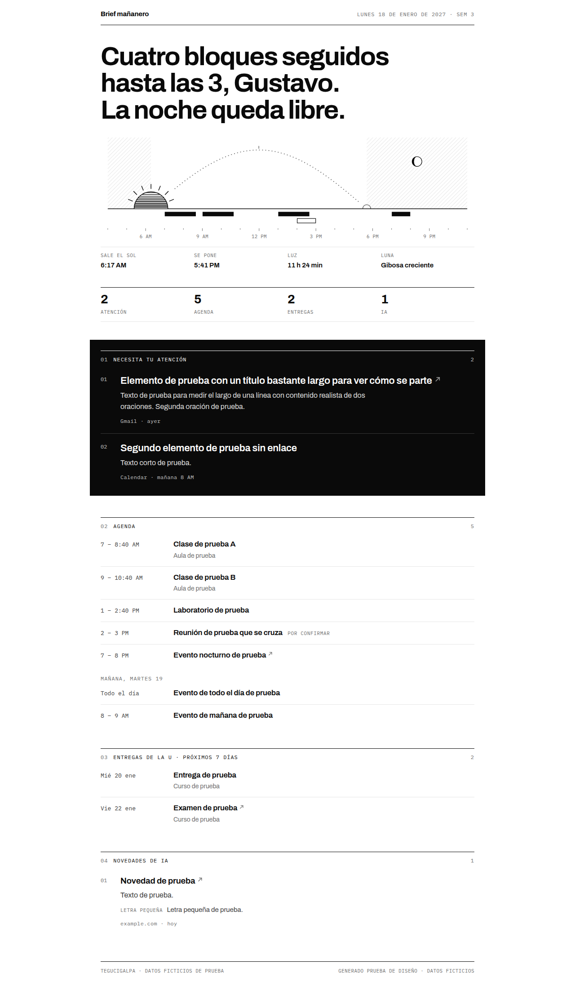

# MelarLab

Mi sistema de automatizaciones para tener más orden en la vida. Lema: *vida con ventaja*.

**Melar**, según la RAE, es lo que hacen las abejas cuando hacen la miel y la ponen en los vasillos de los panales: producir algo de valor y guardarlo en su lugar. Eso es lo que hace cada módulo de este proyecto con una parte de mi día.

## Qué hace hoy

- **Mi Día:** cada mañana, de lunes a viernes, una página con la agenda de hoy, lo que necesita mi atención, las entregas de la U y un par de novedades de IA. Se genera sola en la nube y me llega un aviso al celular.
- **Radar:** cada domingo, un resumen de lo más útil que pasó en IA esa semana, verificado en su fuente.
- **La app para celular** (en construcción): se instala desde el navegador en Android y en iPhone, pide cuenta y funciona sin internet. Ya muestra el Mi Día real de cada mañana, la lista de Pendientes, la Billetera (un gasto se anota con el monto y un toque), el Descanso (cómo vengo durmiendo), las Comidas (qué hay de comer y el plan de los próximos días), el Gym (qué toca hoy y la semana) y el plan de Estudios con el avance de la carrera; los demás módulos llegan como pantallas de la app. Detalle en [app/README.md](app/README.md).

## Módulos

| Área | Módulo | Qué hace | Estado |
|---|---|---|---|
| Organización | Mi Día | Resumen de cada mañana con lo de hoy de todos los módulos | Activo |
| | Pendientes | Cosas por hacer con fecha límite | Activo |
| | Agenda | Reuniones y eventos; preparación antes de cada reunión | Planeado |
| Aprendizaje | Radar | Contenido relevante sobre mis temas | Activo |
| | Estudios | Plan de estudios, clases, exámenes y avance de la carrera | Activo: plan y avance. Falta el calendario de la U |
| Salud | Gym | Rutina y registro de entrenos | Activo |
| | Comidas | Plan de comidas y lista del súper | Activo: falta la lista del súper |
| | Descanso | Horario de sueño y horas dormidas | Activo |
| Dinero | Billetera | Ingresos, gastos y resumen del mes | Activo |
| | Lista de deseos | Productos que quiero comprar y su precio | Planeado |
| Negocio | Clientes | Prospección y seguimiento de clientes | Planeado |
| | Contenido | De una idea a publicaciones para cinco redes | Planeado |

Detalle de cada uno en [docs/modulos.md](docs/modulos.md) y el orden en que se construyen en [docs/hoja-de-ruta.md](docs/hoja-de-ruta.md).

## Cómo funciona

- **Mi Día es el centro.** Junta una o dos líneas de cada módulo.
- **Todo pasa por una app para celular.** Es una app web instalable (PWA) hecha con React, Vite y TypeScript: un solo código para Android y iPhone, sin tiendas y a $0. Gastos, entrenos, comidas, horas de sueño y pendientes se registran ahí mismo, en segundos.
- **Supabase guarda las cuentas y los datos.** Una tabla por módulo en Postgres, con reglas por usuario (RLS): cada quien ve y cambia solo lo suyo. Detalle en [docs/base-de-datos.md](docs/base-de-datos.md).
- **Cloudflare Pages publica la app** cada vez que cambia `main`, con una política de contenido (CSP) estricta.
- **Una rutina de Claude Code arma Mi Día** en la nube a las 5:50 AM: lee Google Calendar y Gmail, verifica las novedades de IA en su fuente y publica el JSON en Supabase con un secreto que Claude no ve ([docs/base-de-datos.md](docs/base-de-datos.md#mi-día)). No depende de que la laptop esté encendida.
- **El diseño vive en código.** [`render_brief.py`](modulos/mi-dia/render_brief.py) convierte el JSON en HTML con el mismo diseño todos los días: blanco y negro, tipografía Archivo e IBM Plex Mono, y una ilustración del amanecer calculada con datos reales (salida y puesta del sol con la calculadora de la NOAA y fase de la luna). La pantalla Mi Día de la app usa el mismo diseño y el mismo JSON.
- **Antes de la app, el plan era una hoja de Google Sheets y un bot de Telegram.** La hoja fue el primer esquema de datos ([docs/hoja-melarlab.md](docs/hoja-melarlab.md)) y de ahí salieron las tablas de Supabase.

## Estructura

```
melarlab/
├── app/                 la app para celular (PWA): Mi Día, instalable y sin internet
├── modulos/
│   ├── mi-dia/          render_brief.py, prompt de ejemplo y datos de prueba
│   └── radar/           prompt de ejemplo
├── supabase/            migraciones de la base de datos y prueba de seguridad (RLS)
├── herramientas/        pruebas de la app, auditoría de accesibilidad, capturas e íconos
└── docs/                módulos, base de datos, hoja de ruta, esquema original de la hoja y capturas
```

## Probarlo

La app tiene sus propios pasos y pruebas en [app/README.md](app/README.md).

La página de Mi Día, con Python 3 (solo librería estándar). Para incrustar las fuentes hace falta `npm`; sin él, la página usa las fuentes del sistema.

```bash
python3 modulos/mi-dia/render_brief.py modulos/mi-dia/ejemplos/dia-cargado.json mi-dia.html
```

Auditoría de accesibilidad (WCAG 2.1 AA con axe-core, en claro y oscuro, a 390 y 1280 px) y capturas:

```bash
npm install
npx playwright install chromium
npm run auditar -- mi-dia.html
npm run capturas -- mi-dia.html docs/capturas/mi-dia
```



## Privacidad

Este repositorio solo tiene código, prompts de ejemplo y datos ficticios. Correos, calendario, gastos, salud y cualquier dato personal viven en mis cuentas y nunca se suben aquí (ver [.gitignore](.gitignore)).

## Costo

$0 adicional: usa lo que ya incluye mi cuenta de Claude y planes gratis (Supabase, Cloudflare Pages, Google Calendar y Gmail).

## Licencia

[MIT](LICENSE).
