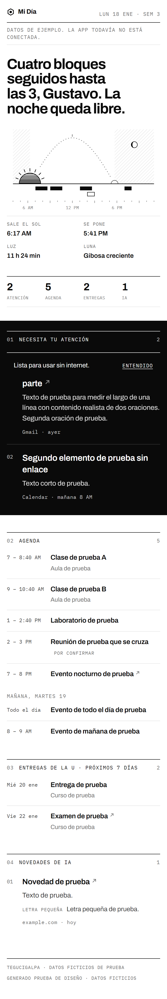

# MelarLab · app

La app para celular de MelarLab. Es una app web instalable (PWA): se instala desde el navegador en Android y en iPhone, queda en la pantalla de inicio y funciona sin internet.

Por ahora tiene cuentas (entrar, crear cuenta, recuperar la contraseña y cerrar sesión, con Supabase Auth) y siete pantallas:

- **Mi Día**, con los datos reales de cada mañana: una rutina de Claude Code lo publica en la tabla `mi_dia` de Supabase de lunes a viernes a las 5:50 AM ([docs/base-de-datos.md](../docs/base-de-datos.md#mi-día)). También muestra los pendientes atrasados y de hoy.
- **Pendientes** (`/pendientes`): agregar en segundos, marcar como hecho, editar y borrar, agrupados en atrasados, hoy, próximos y sin fecha.
- **Billetera** (`/billetera`): anotar un gasto o un ingreso con el monto y un toque en la categoría (fecha, moneda y detalle son opcionales), con Deshacer. Debajo, el resumen del mes por categoría, los meses anteriores (hasta 12) y los movimientos por día, con editar y borrar. Mi Día dice lo gastado en el mes y hoy. En Android, al mantener presionado el ícono aparece "Anotar un gasto".
- **Descanso** (`/descanso`): anotar la noche con la hora de dormir y la de despertar (y, si quiero, cómo dormí); las horas se calculan solas y cruzan la medianoche. El resumen de los últimos 7 días contra la meta de 7 horas, las barras de las últimas dos semanas y un aviso si llevo 3 noches cortas seguidas. Mi Día lo dice en su sección de Salud.
- **Comidas** (`/comidas`): qué hay de comer hoy (el momento sale de la hora), anotar o planear los próximos días con el mismo formulario, y cuántas comidas de la semana fueron hechas en casa. Una comida por momento del día: si ya hay, guardar la cambia. Mi Día dice qué hay de comer hoy.
- **Gym** (`/gym`): el plan de la semana (qué rutina toca cada día; los días vacíos son de descanso) y anotar el entreno: si hoy toca, la rutina ya viene puesta y anotar es un toque. La semana de lunes a domingo muestra qué se entrenó y qué falta. Mi Día dice si hoy toca gym y cuántos van.
- **Estudios** (`/estudios`): el plan de estudios por período, con el estado de cada materia (pendiente, cursando o aprobada), la nota y el avance de la carrera. La primera vez carga con un botón el plan de Ingeniería en Sistemas Computacionales de UNITEC (2025: 17 períodos y 230 créditos); también se pueden agregar materias una por una.

Las pantallas de los demás módulos llegan en los siguientes pasos de la [hoja de ruta](../docs/hoja-de-ruta.md).



## Stack

| Pieza | Qué se usa |
|---|---|
| App | React 19 + Vite 8 + TypeScript |
| Instalable y sin internet | [`vite-plugin-pwa`](https://vite-pwa-org.netlify.app/) con Workbox: manifiesto, íconos y service worker que guarda la app completa en el celular |
| Fuentes | Archivo e IBM Plex Mono desde `@fontsource`, solo el subconjunto latino, guardadas junto con la app |
| Cuentas | Supabase Auth con correo y contraseña (`@supabase/supabase-js`) |
| Datos | Supabase: Postgres, una tabla por módulo con RLS ([docs/base-de-datos.md](../docs/base-de-datos.md)) |
| Hosting | Cloudflare Pages, conectado al repositorio: cada cambio en `main` se publica solo |
| Seguridad del navegador | Política de contenido (CSP) y cabeceras de seguridad en `dist/_headers`, generadas al compilar |

## Estructura

```
app/
├── index.html              metadatos, color de la barra y ícono de iPhone
├── .node-version          versión de Node para compilar en Cloudflare Pages
├── vite.config.ts          manifiesto, service worker y cabeceras de seguridad
├── public/                 favicon e íconos (se generan con npm run iconos, desde la raíz)
└── src/
    ├── main.tsx            arranque y fuentes
    ├── App.tsx             qué pantalla toca según la sesión y la dirección
    ├── rutas.ts            direcciones de la app (/, /pendientes y /estudios) y el foco al cambiar de pantalla
    ├── navegacion.tsx      barra de módulos y enlaces entre pantallas
    ├── Marco.tsx           encabezado, barra y pie de las pantallas que no son Mi Día
    ├── guardado.ts         copias en el celular para ver sin internet; cerrar sesión las borra
    ├── formularios.tsx     piezas de formulario compartidas: opciones de un select y la fecha con Hoy y Ayer
    ├── useTabla.ts         una tabla de Supabase con su copia en el celular: cuándo consulta y cómo se actualiza (lo usan los módulos)
    ├── comidas/
    │   ├── useComidas.ts      leer, anotar, cambiar y borrar en la tabla comidas; el momento según la hora y las caseras
    │   └── Comidas.tsx        la pantalla: hoy, anotar o planear, los próximos días y la semana
    ├── cuenta/
    │   ├── supabase.ts     cliente de Supabase (solo la clave publicable)
    │   ├── base-de-datos.ts  tipos de las tablas (generado)
    │   ├── useSesion.ts    estado de la sesión, también sin internet
    │   ├── Entrada.tsx     entrar, crear cuenta, recuperar y elegir contraseña nueva
    │   └── mensajes.ts     errores de Supabase en español
    ├── estilos.css         diseño de Mi Día (blanco y negro, claro y oscuro) y avisos de la app
    ├── mi-dia/
    │   ├── MiDia.tsx       la pantalla, con la misma estructura que render_brief.py
    │   ├── Amanecer.tsx    ilustración "amanecer con datos"
    │   ├── cielo.ts        salida y puesta del sol (NOAA) y fase de la luna
    │   ├── formato.ts      fechas y horas en español
    │   ├── tipos.ts        forma del JSON de Mi Día
    │   ├── useMiDia.ts     trae el Mi Día más reciente de Supabase y guarda una copia para verlo sin internet
    │   └── normalizar.ts   descarta lo que no se puede dibujar, para que un dato raro no rompa la pantalla
    ├── pendientes/
    │   ├── usePendientes.ts   leer, agregar, cambiar y borrar en la tabla pendientes; grupos por fecha
    │   └── Pendientes.tsx     la pantalla: agregar, lista por grupos, editar y borrar
    ├── billetera/
    │   ├── useBilletera.ts    leer, anotar, cambiar y borrar en la tabla billetera; montos, resumen del mes y días
    │   └── Billetera.tsx      la pantalla: anotar con un toque, resumen por categoría, meses y movimientos
    ├── descanso/
    │   ├── useDescanso.ts     leer, anotar, cambiar y borrar en la tabla descanso; horas, meta y resumen de la semana
    │   └── Descanso.tsx       la pantalla: anotar la noche, la semana con barras y las noches anotadas
    ├── gym/
    │   ├── useGym.ts          leer, anotar, cambiar y borrar entrenos (tabla gym) y guardar el plan (tabla gym_plan); la semana
    │   └── Gym.tsx            la pantalla: la semana, anotar el entreno, el plan y los entrenos anotados
    ├── estudios/
    │   ├── plan-unitec.ts     el plan oficial de UNITEC (información pública), listo para cargarlo de una vez
    │   ├── useEstudios.ts     leer, agregar, cambiar (una o un período entero) y borrar en la tabla estudios; avance y períodos
    │   └── Estudios.tsx       la pantalla: cargar el plan, avance, períodos, marcar aprobadas, editar y agregar
    └── pwa/
        ├── AvisoActualizacion.tsx   "Lista para usar sin internet" y "Hay una versión nueva"
        ├── Instalar.tsx             botón de instalar (Android) o instrucciones (iPhone)
        └── useEnLinea.ts            aviso de sin conexión
```

El cálculo del sol y la luna es el mismo de `render_brief.py`: se comparó con el script de Python en 16 casos (dos ciudades, años bisiestos y cambio de año) y coincide.

## Configuración

Copia `.env.example` como `.env.local` y pon la dirección y la clave publicable del proyecto de Supabase. La clave secreta nunca va en la app.

En el panel de Supabase:
- **Authentication → URL Configuration:** agregar a *Redirect URLs* las direcciones donde corre la app (`http://localhost:4173/**`, `http://localhost:5173/**` y la de Cloudflare Pages). Si no están, el enlace del correo vuelve a la *Site URL*.
- **Authentication → Sign In / Providers → Email:** largo mínimo de la contraseña en 8, igual que la app.

## Publicar en Cloudflare Pages

La app se publica sola con cada cambio en `main`. Configuración del proyecto (*Workers & Pages → Create application → Pages → Import an existing Git repository*):

| Ajuste | Valor |
|---|---|
| Rama de producción | `main` |
| Framework preset | None (los valores se ponen a mano) |
| Build command | `npm run build` |
| Build output directory | `dist` |
| Root directory | `app` |
| Variables | `VITE_SUPABASE_URL` y `VITE_SUPABASE_PUBLISHABLE_KEY`, los mismos valores de `.env.local` |

- **Node:** la versión sale de `app/.node-version`.
- **Sin las dos variables, la compilación falla a propósito** (Cloudflare pone `CF_PAGES=1`), en vez de publicar una app que solo dice "Falta configurar".
- **Cabeceras:** al compilar se genera `dist/_headers` con la política de contenido (CSP), que solo deja cargar lo propio y conectarse con el proyecto de Supabase, y con `X-Frame-Options`, `Referrer-Policy`, `Permissions-Policy` y `noindex`. `npm run preview` sirve la app con las mismas cabeceras, así que las pruebas locales corren con ellas puestas.
- **Rutas:** como no hay un `404.html`, Cloudflare trata la app como de una sola página y cualquier dirección abre `index.html`.
- **Después de la primera publicación,** en Supabase: poner la dirección de Cloudflare como *Site URL* y agregarla a *Redirect URLs* (`https://<proyecto>.pages.dev/**`).

## Comandos

Dentro de `app/`:

```bash
npm install
npm run dev        # desarrollo en http://localhost:5173 (sin service worker)
npm run build      # revisa tipos y compila en dist/
npm run preview    # sirve dist/ en http://localhost:4173, con service worker
npm run lint
```

Pruebas, desde la raíz del repositorio y con `npm run preview` corriendo:

```bash
npm run pwa -- http://localhost:4173        # cabeceras de seguridad, instalable, sin internet, avisos de Android y iPhone
npm run cuentas -- http://localhost:4173    # entrar, crear cuenta, recuperar, cerrar sesión y sin internet
npm run mi-dia -- http://localhost:4173     # Mi Día de hoy, de otro día, todavía ninguno, errores, sin internet y datos raros
npm run pendientes -- http://localhost:4173 # agregar, grupos, hecho, editar, borrar, errores, sin internet, Mi Día y navegación
npm run billetera -- http://localhost:4173  # anotar con un toque, deshacer, montos, dólares, resumen, meses, editar, Mi Día y sin internet
npm run descanso -- http://localhost:4173   # anotar la noche, cambiarla, horas que no sirven, noches cortas, semana, Mi Día y sin internet
npm run comidas -- http://localhost:4173    # qué hay de comer, anotar, cambiar, planear, hechas en casa, Mi Día y sin internet
npm run gym -- http://localhost:4173        # armar el plan, hoy toca, anotar, deshacer, cambiar el plan, la semana, Mi Día y sin internet
npm run estudios -- http://localhost:4173   # cargar el plan, aprobar y deshacer, cursando, notas, código repetido, errores y sin internet
npm run auditar -- http://localhost:4173    # accesibilidad WCAG 2.1 AA en claro y oscuro, a 390 y 1280 px
npm run capturas -- http://localhost:4173 docs/capturas/app
```

La prueba de cuentas simula Supabase Auth dentro del navegador de prueba: no crea cuentas reales ni envía correos, y ninguna llamada sale de la computadora.

Si Playwright no encuentra Chromium, se le indica el navegador instalado con `CHROMIUM_PATH` (por ejemplo, la ruta de Chrome).

## Decisiones

- **La versión nueva no se instala sola.** La app avisa "Hay una versión nueva" y se actualiza al tocar "Actualizar", para no recargar la pantalla a mitad de un registro.
- **Correo y contraseña.** En iPhone, la app instalada y Safari no comparten lo guardado: un enlace mágico por correo se abriría en Safari y dejaría la sesión allá. Con contraseña se entra directo en la app.
- **Flujo implícito de Supabase.** Los enlaces de confirmar y de recuperar funcionan aunque se abran en otro navegador.
- **Sin internet se sigue viendo Mi Día.** Si hay una sesión guardada, la app no espera a que Supabase renueve el permiso; lo renueva sola al volver la red.
- **Mi Día real, con copia en el celular.** La app pide el Mi Día más reciente (las reglas de la base solo le dan el suyo a cada usuario) y guarda una copia para abrirlo sin internet. Vuelve a consultar al abrir la app y al volver la red. Si el más reciente es de otro día (fin de semana o antes de las 5:50), lo dice. Cerrar sesión borra la copia.
- **Pendientes: para escribir hace falta internet.** Sin red se ve la última lista guardada, pero agregar, marcar y editar se desactivan. Así no hay cambios guardados a medias que después choquen con la base.
- **Marcar como hecho se ve al instante.** Si la base no lo acepta, el pendiente vuelve a como estaba y un aviso lo dice arriba de la lista.
- **Billetera: anotar es escribir el monto y tocar la categoría.** La categoría es el botón de guardar; sin monto válido no se envía nada, y el aviso trae Deshacer. Lo opcional (fecha, moneda y detalle) va plegado, pero si la fecha no es hoy o la moneda no es lempiras, se ve en el resumen plegado.
- **Cada moneda se suma aparte.** Los montos en dólares no se convierten a lempiras: el resumen muestra un bloque por moneda. Las sumas van en centavos enteros para no arrastrar errores de redondeo.
- **Descanso: una noche por día.** La noche lleva la fecha del día en que me desperté. Si ese día ya tiene una, el formulario la muestra y guardar la cambia, en vez de crear otra.
- **La barra de módulos se desplaza de lado** cuando no caben todos: la pantalla actual queda a la vista y un desvanecido en el borde avisa que hay más.
- **Comidas: el plan y el registro son la misma tabla.** Lo anotado para un día que todavía no llega es el plan; para hoy o antes, lo que se comió. La lista del súper queda para después.
- **Gym: el plan va en su propia tabla** (`gym_plan`, una rutina por día). Guardarlo es una sola llamada que agrega o cambia por día, y otra que borra los días que quedaron vacíos.
- **Estudios: el avance sale de las materias.** El total es la suma de los créditos del plan y el porcentaje se redondea hacia abajo, para que no diga 100 % antes de tiempo. El promedio pondera por créditos las notas registradas; no es el índice oficial de la universidad.
- **Todo un período de una vez, con Deshacer.** "Aprobar el período" y "Cursar el período" cambian sus materias en una sola llamada; el aviso trae Deshacer. Los períodos ya aprobados salen plegados.
- **Direcciones reales.** Mi Día es `/`, Pendientes `/pendientes`, Billetera `/billetera`, Descanso `/descanso`, Comidas `/comidas`, Gym `/gym` y Estudios `/estudios`: el botón de atrás funciona y, al cambiar de pantalla, el foco va al título para que un lector de pantalla lo anuncie.
- **Los datos de Mi Día se revisan antes de dibujarlos.** Lo que no tiene lo mínimo (un título, una hora que existe) se descarta, y el texto nunca se interpreta como HTML.
- **Mensajes sin detalles internos.** Los errores de Supabase se muestran en español y cortos; crear cuenta y recuperar la contraseña no revelan si un correo ya está registrado.
- **Política de contenido estricta.** Sin scripts ni estilos en línea y sin conexiones a otros dominios. Si algún día se cuela contenido ajeno (un correo, un evento), el navegador no lo ejecuta ni manda datos afuera.
- **Solo enlaces https.** Igual que en `render_brief.py`, cualquier otro enlace se muestra como texto.
- **Sin datos personales en el repositorio.** Mi Día llega de Supabase; las pruebas y las capturas usan los datos ficticios de ejemplo.
