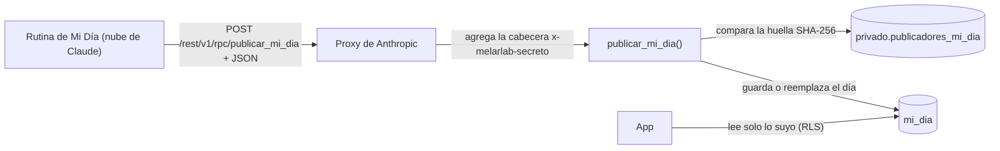

# La base de datos

Los datos de la app viven en Supabase (Postgres). Hay una tabla por módulo, salida del esquema de la [hoja MelarLab](hoja-melarlab.md), que queda como antecedente, más `mi_dia`, donde la rutina de la mañana publica el resumen del día ([abajo](#mi-día)), `radar`, donde la rutina de los domingos publica el Radar semanal ([abajo](#radar)), y `avisos_push`, los celulares que reciben el aviso de las 6:00 ([abajo](#avisos)). Agenda no tiene tabla: lee Google Calendar y Gmail.

Las migraciones están en [`supabase/migrations/`](../supabase/migrations/) y las pruebas de seguridad en [`supabase/pruebas/`](../supabase/pruebas/): `rls.sql` para las tablas de los módulos, `mi_dia.sql` para Mi Día, `radar.sql` para el Radar y `avisos.sql` para los avisos.

## Seguridad

- **Cada fila tiene dueño.** `usuario_id` se llena solo con el usuario que entró (`auth.uid()`). Si se borra la cuenta, se borran sus filas.
- **RLS en todas las tablas**, con cuatro reglas: cada usuario solo ve, agrega, cambia y borra lo suyo. Tampoco puede pasarle una fila a otro usuario.
- **Permisos mínimos.** Los visitantes sin cuenta (`anon`) no tienen ningún permiso. Los usuarios con cuenta (`authenticated`) solo pueden ver, agregar, cambiar y borrar: no pueden vaciar tablas con TRUNCATE, que no pasa por RLS. El proyecto da todos los permisos por defecto, así que la migración los quita de forma explícita.
- **Validaciones en la base**, no solo en la app: listas cerradas, montos mayores que 0, largos máximos, notas de 0 a 100, calidad de 1 a 5 y enlaces solo `https://`, para que no se pueda guardar un enlace `javascript:`.

## Columnas comunes

Todas las tablas tienen `id`, `usuario_id`, `creado` y `actualizado`. `actualizado` se pone solo en cada cambio.

## Tablas

Los valores de las listas se guardan en minúscula y sin tildes; la app los muestra con su nombre en español.

| Tabla | Columnas | Valores permitidos |
|---|---|---|
| `pendientes` | tarea, area, fecha_limite, prioridad, estado, notas | area: universidad, personal, trabajo, melarlab. prioridad: alta, media, baja. estado: pendiente, en_curso, hecho |
| `estudios` | periodo, codigo, asignatura, creditos, estado, nota_final, notas | estado: pendiente, cursando, aprobada. Un código por usuario |
| `billetera` | fecha, tipo, monto, moneda, categoria, descripcion | tipo: ingreso, gasto. categoria: comida, transporte, universidad, salud, entretenimiento, compras, servicios, trabajo, otro. moneda: código de 3 letras, HNL por defecto |
| `gym` | fecha, rutina, duracion_min, notas | duración de 1 a 600 minutos |
| `gym_plan` | dia, rutina | qué rutina toca cada día de la semana: 1 = lunes … 7 = domingo; un día sin fila es de descanso. Una sola rutina por día y por usuario (desde el 2026-10-01) |
| `comidas` | fecha, momento, comida, casera, notas | momento: desayuno, almuerzo, cena, merienda |
| `descanso` | fecha, me_dormi, me_desperte, horas_dormidas, calidad, notas | horas_dormidas se calcula sola y cruza la medianoche (23:30 a 06:00 da 6.50). calidad de 1 a 5 |
| `lista_deseos` | producto, enlace, precio, precio_objetivo, moneda, prioridad, estado, notas | estado: quiero, comprado, descartado |
| `clientes` | negocio, contacto, rubro, estado, ultimo_contacto, proximo_seguimiento, notas | estado: prospecto, contactado, en_conversacion, cliente, descartado |
| `contenido` | idea, formato, redes, estado, fecha_publicacion, enlace | formato: reel, carrusel, post, video_largo, historia. redes: tiktok, instagram, linkedin, facebook, youtube. estado: idea, en_produccion, publicado |

Las fechas son `date` y la app siempre manda la fecha local del celular: la base está en UTC y una fecha por defecto podría caer en el día equivocado de noche.

## Mi Día

Mi Día no lo escribe la app ni el usuario: lo publica cada mañana una rutina de Claude Code que corre en la nube.

- **`mi_dia`:** un registro por usuario y por día (`fecha`), con el JSON de Mi Día en `datos` (la misma forma que usa `render_brief.py`, [`app/src/mi-dia/tipos.ts`](../app/src/mi-dia/tipos.ts)). Cada usuario solo puede leer el suyo. Nadie puede agregar, cambiar ni borrar filas directo.
- **`publicar_mi_dia(datos)`** es la única forma de escribir. Es `SECURITY DEFINER` y la puede llamar cualquiera con la clave publicable (rol `anon`), pero lo primero que hace es pedir el secreto en la cabecera `x-melarlab-secreto`. Sin él responde 401 "No autorizado.". El aviso de Supabase sobre esta función es esperado.
- **El secreto no está en la base.** Solo su huella SHA-256, en `privado.publicadores_mi_dia`, un esquema que la API no expone y en el que nadie de afuera tiene permisos. El secreto vive en la credencial del entorno de la nube de Claude: el proxy lo agrega a la solicitud después de que sale de la sesión, así que Claude no lo ve.
- **Validaciones:** un objeto JSON de hasta 100 KB, solo las claves que conoce `render_brief.py`, secciones que son listas de hasta 50 elementos, titular de hasta 300 caracteres y una fecha de ayer, hoy o mañana en Honduras. Publicar otra vez el mismo día reemplaza al anterior.
- **Lo que un secreto robado permite:** publicar un Mi Día falso de ayer, hoy o mañana, que la app muestra como texto. Nada más: no lee datos ni toca las otras tablas. Se cambia generando otro secreto y reemplazando la huella.

## Radar

El Radar semanal de IA se publica igual que Mi Día, con el mismo secreto: la rutina de los domingos llama a `publicar_radar(datos)` y la app solo lee.

- **`radar`:** un registro por usuario y por fecha (el domingo en que salió), con el JSON del Radar en `datos` ([`app/src/radar/radar.ts`](../app/src/radar/radar.ts)): titular, resumen, de 1 a 12 novedades, una herramienta para probar, una idea de servicio y las fuentes. Se guardan todos; la app muestra los últimos 8. Cada usuario solo lee los suyos y nadie escribe directo.
- **`publicar_radar(datos)`:** pide el mismo secreto que `publicar_mi_dia()` (la huella está en `privado.publicadores_mi_dia`). Valida las claves, el tamaño (100 KB), las listas y una fecha de la última semana. Publicar otra vez la misma fecha reemplaza al anterior. El aviso de Supabase sobre esta función también es esperado.
- **La app revisa lo que llega:** una novedad sin título no se dibuja, los enlaces que no son https quedan como texto y nada se interpreta como HTML.

## Avisos

El aviso de Mi Día llega al celular con web push, sin pasar por la app de Claude. De lunes a viernes, Cron llama a la función `avisos` ([`supabase/functions/avisos/`](../supabase/functions/avisos/)) a las 6:00 y a las 6:30 de Honduras:

- **6:00:** si el Mi Día de hoy ya está, manda "Mi Día" con su titular.
- **6:30:** si todavía no está, manda "Mi Día no llegó" a quien tiene la rutina (el aviso de monitoreo de la sección de seguridad).
- **Un aviso por celular y por día:** lo que ya se mandó queda anotado en `ultimo_aviso`.

Las piezas:

- **`avisos_push`:** una fila por celular (o navegador) y por usuario: la dirección del servicio de push (`endpoint`) y las llaves del celular para cifrar (`p256dh`, `auth`). Cada usuario ve, agrega y borra solo las suyas; nadie las cambia (`ultimo_aviso` lo anota la función). Hasta 10 por usuario. Solo acepta los servicios de push de los navegadores (Google, Apple, Mozilla y Windows).
- **`llave_avisos()`:** la llave pública VAPID, para que la app suscriba el celular. Solo con sesión.
- **`avisos_por_enviar(secreto, ultimo_intento)`, `avisos_enviados(secreto, enviados, vencidos)` y `guardar_llaves_avisos(secreto, publica, privada)`:** las usa la función `avisos`, con la clave publicable y el secreto de los avisos en el cuerpo. Sin el secreto responden 401 "No autorizado.". La base decide qué mandar y a quién; la función solo cifra (RFC 8291), firma (VAPID, RFC 8292) y manda. Las suscripciones que el servicio de push da por vencidas (404 o 410) se borran. Los avisos de Supabase sobre estas funciones son esperados, como los de `publicar_mi_dia()`.
- **Los secretos viven en el Vault de Supabase:** `melarlab_avisos` (el secreto de Cron, creado al azar dentro de la base: nadie lo conoce), las llaves VAPID (las crea la función la primera vez) y `project_url`. El secreto viaja en el cuerpo y no en una cabecera, para que no quede en los registros. La función no usa la llave secreta de Supabase.
- **En los registros** de la función solo queda cuántos avisos salieron, nunca a qué dirección ni qué decían.

## Cambios

Cada cambio de estructura es una migración nueva en `supabase/migrations/`, con la fecha y hora en el nombre. Después de aplicarla:

1. Correr `supabase/pruebas/rls.sql`, `supabase/pruebas/mi_dia.sql`, `supabase/pruebas/radar.sql` y `supabase/pruebas/avisos.sql` en el editor SQL de Supabase. Terminan con un error a propósito, así no guardan nada, y el mensaje trae el resultado: todo tiene que salir bien.
2. Revisar los avisos de seguridad y de rendimiento de Supabase.
3. Volver a generar los tipos de la app (`app/src/cuenta/base-de-datos.ts`).
